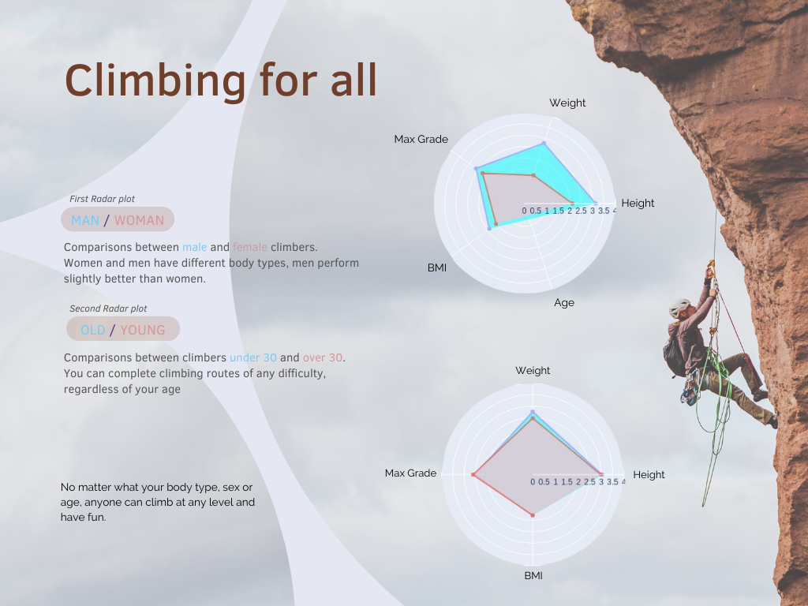

# Climbing for all - Data Vizualisation

The objective of this work was to manipulate a dataset. The work starts with a manipulation of the dataset in order to explore it. We sought to find conclusions on this exploration. Then a visualization of our conclusions was made.

